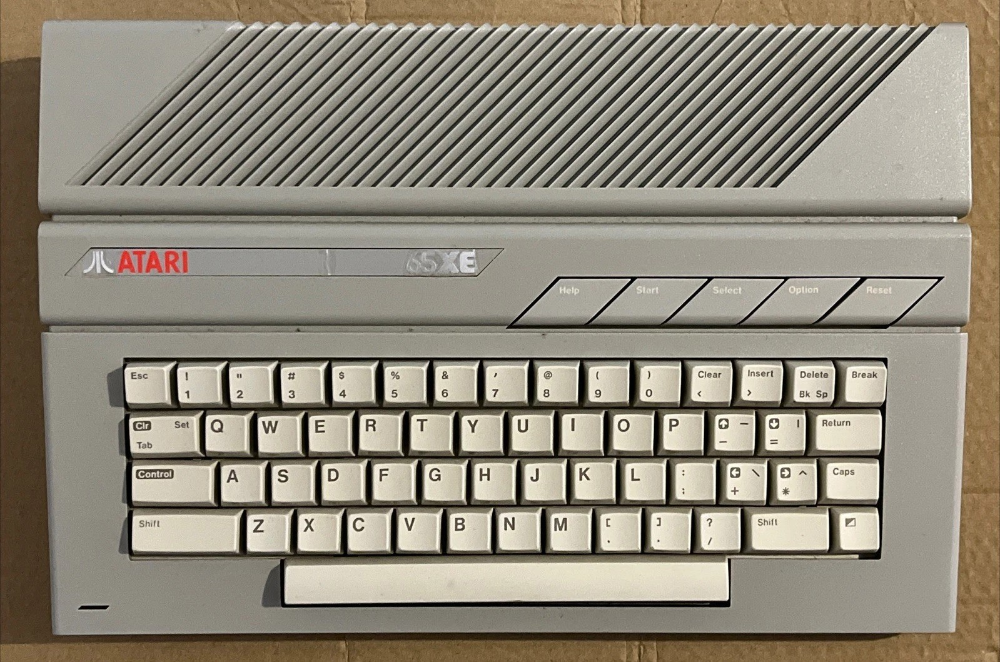
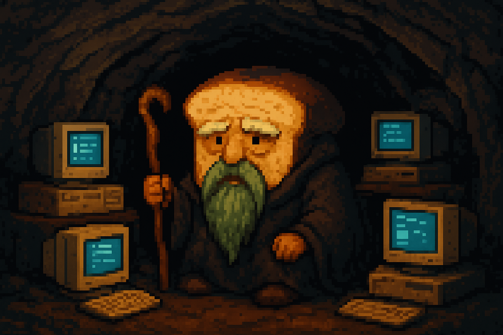

whoami
---

***Lukas "Chleba" Franek***

Open Source Developer

* https://github.com/Chleba
* netscanner, pixelartor, tui-slides, ..
* prusa, seznam.cz, ubiquiti, ..

<!-- pause -->
Also a dinasour🦕:
<!-- column_layout: [1, 1, 1] -->

<!-- column: 0 -->

<!-- column: 1 -->

<!-- column: 2 -->

<!-- reset_layout -->

<!-- end_slide -->

@Chleba
---



<!-- end_slide -->

Topics
---

<!-- font_size: 2 -->
## Local AI
<!-- font_size: 1 -->

<!-- pause -->
* **GUI/CLI/Web:** Points from making native GUI, CLI & Web AI Apps
<!-- pause -->
* **Libraries:** Used open sourced tools and libraries
<!-- pause -->
* **Models:** Experiences with open sourced models and their variants
<!-- pause -->
* **Constrains:** Limitations with using small, open sourced models
<!-- pause -->
* **Projects:** Showcase of developed projects


<!-- end_slide -->

Phylosophy
---

## Why local AI ?

* Privacy
* Can run offline
* No tokens limits
* No censorship (optional)
* Different models

<!-- end_slide -->

Reality
---

## State of today's models

Localy usable models are those with 32b instructions or less that needs to be loaded entirely into a GPU's VRAM.

Tested on HW:

* Macbook/MacStudio with min. 32GB of RAM
* ***Nvidia 5090 with 32GB VRAM***
* Radeon 6700 with 10GB VRAM (!?!)

<!-- pause -->

### Open sourced models

* ~124k - MIT
* ~338k - Apache2.0

<!-- pause -->

#### Localy usable models (32B and less)

* ~40k - MIT
* ~147k - Apache2.0

<!-- end_slide -->

Speed
---

## Models in numbers

Run on Nvidia RTX 5090 32GB VRAM using Ollama (v0.12.6)

| model            | params       |  tps     |
| ------           | ------       | ------   |
| gtp-oss          | 20b          | **~220** |
| mistral-small3.2 | 24b          | **~88**  |
| gemma3           | 27b          | **~77**  |
| qwen2.5vl        | 32b          | **~64**  |
| deepseek-r1      | 32b          | **~61**  |

<!-- end_slide -->

Limitations
---
<!-- font_size: 3 -->
# Memory
<!-- font_size: 1 -->
* Smaller models
* Smaller context window
* Less parallel context

<!-- pause -->
## Clustering
* MB HW
* Network bottleneck
* $$$ PRICE $$$

<!-- end_slide -->

Case example
---

### GPU:
Nvidia RTX 5090 32GB VRAM

-------

<!-- column_layout: [1, 1] -->
<!-- column: 0 -->

| Model example | |
| -----         | -----  |
| ***Model***:        | Qwen2.5 |
| ***Parameters:***   | 32b |
| ***Quantization:*** | Q4_K_M |

<!-- column: 1 -->

| App case      | |
| -----         | -----  |
| ***Context window***:        | 10 192.tokens |
| ***Contexts:***   | 2 |

<!-- reset_layout -->

```
VRAM = MW + (KV * CW * P)
```
<!-- pause -->

```
30GB = 22GB + (0.37MB * 10192 * 2)
```

<!-- end_slide -->

Tech stack
---

What I'm using for my AI projects

<!-- column_layout: [1, 1, 1] -->

<!-- column: 0 -->
# Languages
* Rust
* HTML
* JS
* SQL
* bash

<!-- pause -->

## AI
* Ollama
* llama.cpp

<!-- pause -->

<!-- column: 1 -->
### DB
* sqlite
* qdrant
* pqvector
* tantivy (bm25)

<!-- pause -->

<!-- column: 2 -->
### Libraries
* langchain-rs
* ollama-rs
* pandoc
* pdfium
* egui
* ratatui
* rusqlite
* ...

<!-- end_slide -->

Limitations
---

## Memory


